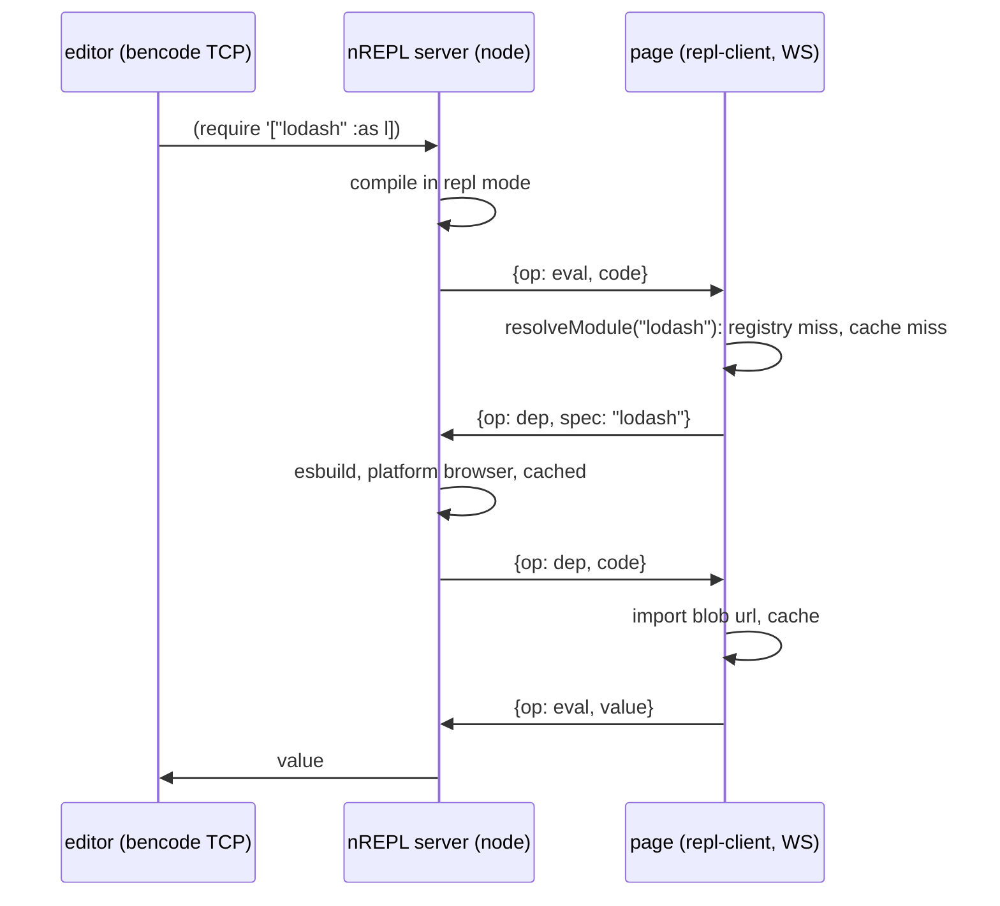

# Browser nREPL without vite

Design for running the squint browser REPL against a page bundled by webpack,
or any bundler that is not vite. The aim is one bundler-agnostic core, not a
webpack port of `vite-common.js`.

## What the vite plugin actually provides

The vite plugin bundles four concerns:

1. Compile: cljs -> js in repl mode, shared ns-state. Already bundler-free
   (the node API).
2. Transport: editor speaks bencode TCP to the nREPL server, the server
   delegates eval to the page over vite's HMR WebSocket. The server side is
   already transport-agnostic: `startServer` takes a `browserTransport`
   object with `send` and `url`, and vite only supplies the socket.
3. Client: an injected page module that receives eval messages, rewrites
   `import('spec')` in eval'd code, evals, prints with `pr-str`, replies.
   Nothing in it needs vite except how it is injected and how specs resolve.
4. Dep resolution: `/@resolve-deps` maps a specifier to the url vite serves
   it at, so the REPL shares the page's module instances. This is the only
   genuinely vite-specific piece. Webpack has no equivalent: app deps are
   sealed inside chunks with no importable url.

So webpack support means replacing 2's socket, 3's injection, and all of 4.

## Design

Three deliverables, all shipping in the squint package.

### 1. `squint-cljs/repl-client`

The browser client extracted from `clientCode` in `vite-common.js` into a
normal module the app entry imports. `connect({url})` opens a WebSocket to
the nREPL server, listens for eval messages in the existing format, and
replies. Dep resolution in eval'd code goes through one function:

```js
async function resolveModule(spec) {
  const reg = globalThis.__squint_deps;        // 1. page registry
  if (reg && spec in reg) return reg[spec];
  if (cache.has(spec)) return cache.get(spec); // 2. session cache
  const code = await requestDep(spec);         // 3. server bundles on demand
  const mod = await import(URL.createObjectURL(
    new Blob([code], { type: 'text/javascript' })));
  cache.set(spec, mod);
  return mod;
}
```

Tier 3 rides the same WebSocket as eval, so no HTTP endpoint is needed. A
spec the server cannot bundle returns esbuild's diagnosis (unresolvable
`node:fs`, package not installed) as the eval error.

The page and the server are different origins, but no CORS setup is needed.
WebSocket handshakes are not CORS-gated, and blob urls are same-origin with
the page that creates them. An HTTP dep endpoint would need CORS headers for
cross-origin `import()`, one more reason for blob over socket.

Tier 3 is an injected capability, not core code. The core calls a
`bundle-dep` function supplied by the host or adapter: the node host injects
the esbuild API, the bb host a shell-out to the esbuild binary or esm.sh,
and the vite adapter whatever matches its vite version, rolldown once vite
drops esbuild. Under vite, tier 3 should rarely fire at all: auto-derive
`optimizeDeps.include` from the string requires in ns-state so every
source-mentioned dep is pre-bundled by vite's own esbuild and resolves
through canonical urls. The injection joins `browserTransport` and `:hot`
as the pluggable seams.

esbuild does not become a squint dependency (squint ships chokidar only).
The node host imports it lazily and errors with an install hint when
missing. Do not rely on vite's transitive esbuild copy: hoisting breaks
under pnpm and rolldown-vite drops esbuild. Declare it in
`peerDependenciesMeta` as optional.

### 2. WebSocket transport on the nREPL server, which also watches

`squint nrepl-server :ws-port 1340` starts the existing server with a
WebSocket listener next to the bencode TCP listener. The WS side plugs into
the same `browserTransport` interface the vite plugin uses today. The
`browser-repl-on-main` branch had a standalone WebSocketServer to crib from.
On a dep request the server runs the esbuild-on-demand bundling from the
`browser-repl-on-demand-deps` POC (stdin proxy, `platform: 'browser'`,
cached) and sends the text back.

Today `nrepl-server` only starts the server (`nrepl-server-cmd` in
`cli_common.cljs`). This design adds watching and compiling to that process,
reusing the chokidar setup from the `watch` command. One process is not
optional: the REPL only knows file-defined vars and aliases through the
ns-state the file compiles build up, and that is an in-process atom. The
vite plugin has the same structure, compile and server in one process
sharing `nsState`. A separate watch process would leave the server blind to
file-defined state.

Hot reload of cljs files uses the bundler's own HMR, as the vite plugin
does. The vite plugin appends a self-accept footer at serve time. Here the
server appends it to the dev output on disk, guarded for both runtimes:

```js
const hot = import.meta.hot ?? import.meta.webpackHot;
if (hot) { hot.dispose(beforeLoadHooks); hot.accept(afterLoadHooks); }
```

A cljs edit then swaps the module in place: it re-runs, rebinds its vars on
`globalThis`, and REPL state survives. All other modules keep the reload
behavior the app already has, no `devServer` changes. The footer logic is
shared with the vite plugin's transform.

For pages served without any HMR runtime, a `:hot :ws` fallback ships the
recompiled repl-mode output over the WS and evals it between the dev hooks,
shadow's mechanism. This covers static file servers and setups where another
server owns the page and webpack is only a watch build, such as a
BigCommerce theme under stencil-cli's storefront emulator. The bundled copy of the
module goes stale but is never consulted again, since cross-ns references
resolve through `globalThis` at call time. This mode needs the page's
auto-refresh off, or an edit is delivered twice.

### 3. Generated dep manifest

Instance sharing with the page cannot use urls under webpack, so it uses the
registry, and squint generates the registry. The compiler already collects
every string require in ns-state. Emit a module from it:

```js
// js/repl_deps.js (generated)
import * as m0 from "preact";
import * as m1 from "canvas-confetti";
globalThis.__squint_deps = { "preact": m0, "canvas-confetti": m1 };
import { connect } from "squint-cljs/repl-client";
connect({ url: "ws://localhost:1340" });
```

The user imports this one file from their webpack entry, dev builds only.
Webpack bundles it like any other module, so the registered instances are
the page's instances. A dep required by browser-targeted cljs is browser
compatible by definition, so no classification step is needed. This is
shadow's external index and cljam's source scan in one file.

## Eval flow



Repl-mode compiled output already fits: files emit literal
`await import('spec')` plus `globalThis.<ns>` defs, which webpack bundles
as-is (dynamic imports with literal strings become async chunks). Only
eval'd code routes imports through `resolveModule`, via the same rewrite the
vite client does today.

## Webpack user workflow

1. Run the combined server from deliverable 2 instead of `squint watch`:
   `squint nrepl-server :ws-port 1340`. It would watch, compile in repl mode
   to the js dir webpack already consumes, and serve nREPL from one process.
2. Add to the webpack entry:

```js
if (process.env.NODE_ENV !== "production") import("./js/repl_deps.js");
```

3. Connect the editor to port 1339 as usual.

No webpack plugin required, no webpack config beyond the entry line.
Webpack's HMR swaps recompiled cljs modules in place via the self-accept
footer, and other assets reload as they already do.

### Optional webpack plugin

DX sugar over the same core, mirroring the vite plugin's one-liner:

```js
const { SquintPlugin } = require('squint-cljs/webpack');
module.exports = { plugins: [new SquintPlugin()] };
```

The plugin runs the combined server inside the webpack process (single
process for free), emits the manifest and injects it into the existing
entry so the user's own entry stays untouched, picks `:hot` by detecting
webpack-dev-server vs a bare watch build (config override available), and
in production mode compiles once without repl output, no server, no
injected entry. Injection must extend an existing entry, not add a new one:
pages that reference fixed bundle files (stencil themes load
`theme-bundle.main.js` from handlebars templates) would never load a new
chunk. Webpack-specific code is only the lifecycle hooks, the
entry injection, and a start-once guard for multi-config setups. The manual
path above remains for setups that cannot touch the webpack config.

## Vite plugin vs generic mode

|                  | vite plugin            | generic (webpack etc.)      |
|------------------|------------------------|-----------------------------|
| socket           | vite HMR WS            | own WS on the nREPL server  |
| client injection | virtual module         | app entry imports manifest  |
| shared instances | canonical dep urls     | `__squint_deps` registry    |
| new dep, no seen | esbuild + middleware   | esbuild + blob over WS      |
| hot reload cljs  | vite HMR, state kept   | webpack HMR, state kept     |

The vite column's new-dep row is the `browser-repl-on-demand-deps` branch,
not released squint. On main a never-seen dep still triggers vite's
optimizer and a page reload.

A later step can rebase the vite client on `squint-cljs/repl-client` so one
client implementation remains.

## The bundler contract

The generic mode asks three things of the page's build:

1. Bundle or serve the compiled js dir as ordinary JS. Repl-mode output is
   plain ESM with literal dynamic imports.
2. Include the generated manifest module in dev builds.
3. Optionally expose an HMR accept API to modules (`import.meta.hot` or
   `import.meta.webpackHot`) for in-place swaps. Without one, `:hot :ws`.

Anything meeting 1 and 2 works: webpack, rspack, rollup, parcel, esbuild,
bun, or no bundler at all, native ESM plus an import map, where the manifest
is just another module on the page. Vite meets the contract too, so the vite
plugin reduces to an adapter that adds vite-specific conveniences: canonical
dep urls (instance sharing for every node_modules dep without a manifest),
virtual-module client injection, and riding vite's WS instead of a second
socket.

## Server hosts

The server side is a protocol, not a node program: bencode TCP to the
editor, JSON over WS to the page, repl-mode compilation with shared
ns-state. The node implementation is one host. babashka can be another: the
compiler runs under SCI (see `examples/babashka/index.clj`), ns-state is an
atom in the bb process, http-kit provides the WS, the fswatcher pod watches,
and esbuild is a Go binary invoked via its CLI with the same stdin proxy. A
bb-served page with an import map is the no-bundler row of the contract, and
same-origin. In that setup a bundling CDN such as esm.sh can replace tier 3
entirely, trading local tooling for a network dependency. JVM Clojure works
the same way.

## Prior art

- shadow-cljs: one runtime registry (`shadow$provide` / `shadow.js.require`),
  REPL deps compiled server-side and shipped over WS, and for external
  bundlers a page-side map checked first (`shadow$bridge`, `nativeRequires`).
  The registry-first order and the error wording come from there.
- cljam: import map built from a source scan, no runtime import for deps.
- `browser-repl-on-demand-deps` branch: the esbuild-on-demand server side.

## Caveats

- HMR self-accept re-runs module side effects on every swap, as documented
  for the vite plugin. `^:dev/before-load` and `^:dev/after-load` hooks
  cover teardown and re-render.
- The `:hot :ws` fallback requires the page's auto-refresh off, or an edit
  is delivered twice.
- A new dep added to source requires a manifest regen plus webpack rebuild
  before it is instance-shared. Until then tier 3 serves a private copy.
- On-demand bundles inline their transitives. A transitive the page already
  has gets a second instance, and module state splits with it: hooks break
  with two React copies, `instanceof` fails across copies, re-run side
  effects can throw (`customElements.define` on a taken name). `import.meta.url`
  inside a blob bundle is a blob url, so asset-resolving packages break.
  Vite avoids this by optimizing all deps in one esbuild run with chunk
  splitting, at the price of the page reload this design removes. Partial
  fix: the client sends the registry keys on connect and the server
  externalizes those specs to a `module.exports = globalThis.__squint_deps[spec]`
  shim. Stateful libs belong in the manifest, not in tier 3.
- CJS deps come back under `.default`, as documented for the vite plugin.
- Deps that import CSS or assets fail with a clear error.
- The WS port accepts eval, and browsers allow cross-origin WS handshakes.
  Bind localhost only, check the `Origin` header, and consider a token in
  the manifest.

## Open questions

- Which command grows the combined mode: `:ws-port` on nrepl-server as
  written here, or `:nrepl` on watch. One process either way.
- Does the combined mode emit the manifest on every compile, or behind a
  `:repl-manifest` flag.
- One port with HTTP upgrade next to bencode, or a second port. Second port
  is simplest.
- Name of the global. `__squint_deps` here, could be `squint$deps`.
- Multi-tab and session routing, shared with the vite plugin's open TODO.
